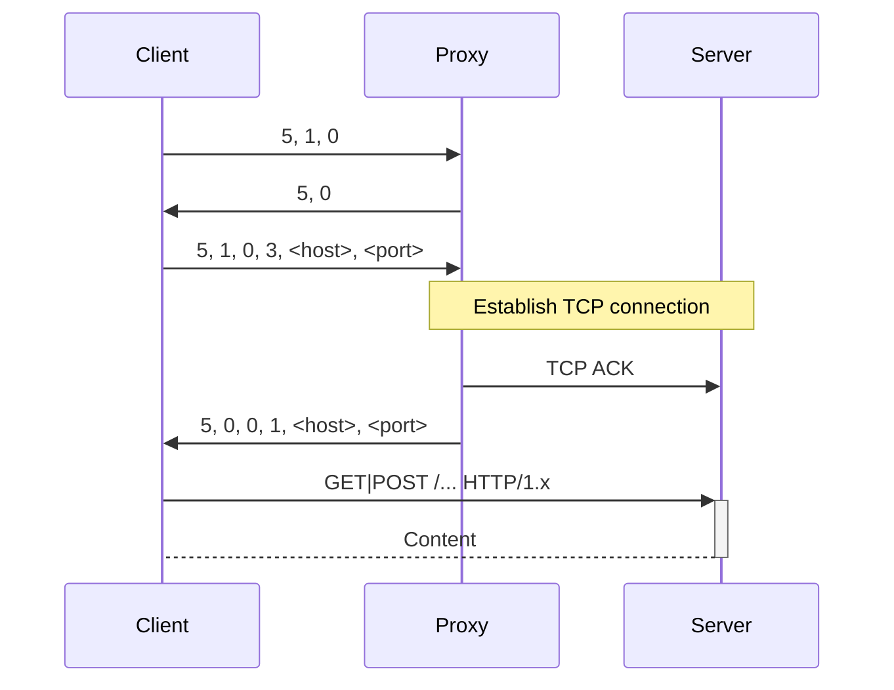
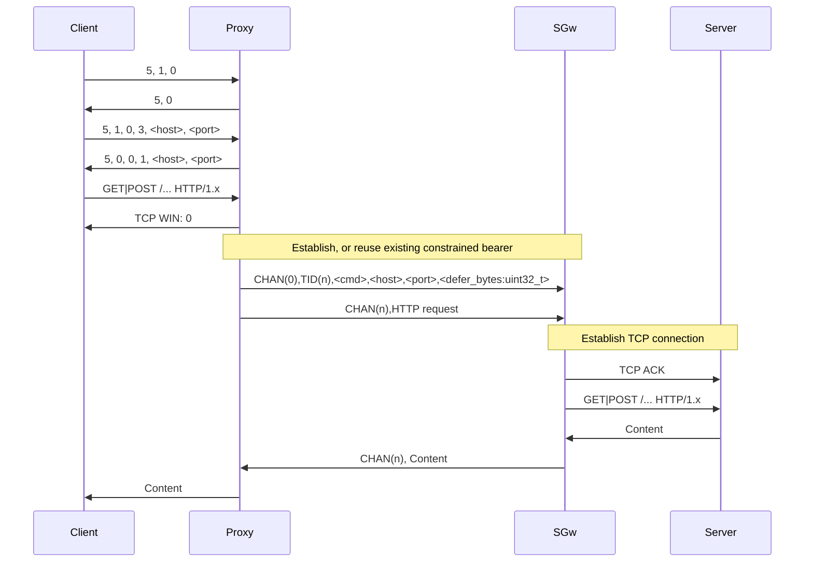

# sockspeppet
A Performance-enhancing Proxy to transport web traffic over a constrained channel

Beyond content optimization on the server's side, a few interesting properties of the SOCKS 5 protocol can be exploited to improve browsing performance over a narrow and/or a high latency link.

## General Idea
This project intends to:
  * Specify an optimized version of the SOCKS protocol to adapt constrained channels (reduced protocol turnaround, parallel transactions over a single bearer, transparent compression when possible, remote DNS requests, client-side filtering, reduce issues linked to TCP timers over high-latency (>10s RTT) channels, especially for connection establishment, remote cookie caching?).
  * Provide an implementation that can bridge a browser's HTTP requests over a balanced-mode AX.25 bearer.

## Standard vs PeP flow
> [!WARNING]
> This is not yet a specification, cases needs to be addressed.

### Standard SOCKS flow

### Sockspeppet flow
> ![WARNING]
> This is not yet a protocol definition.

### OTA protocol
The Over-The-Air proxy protocol is divided into 16 virtual communication circuits. 

It requires a frame-oriented, reliable, ordered delivery, 8-bit clean communication channel. The underlying communication layer **MUST** preserve the integrity of packets. Packets **SHALL NOT** be fragmented, unless the underlying layer is able to use a transparent Packet Assembler-Disassembler.

Circuit 0 is the signaling circuit, used to set up and tear down connections associated to the 15 other circuits.

#### Commands
FIXME

- Path Maximum Packet Size Negociation
- Connect to remote server
- Bind Port
- Send UDP Packet

### Handling abnormal cases
When a connection fails, the Proxy SHALL serve a `HTTP/1.1 503 Service Unavailable` reply, with the failure cause in the page content.
