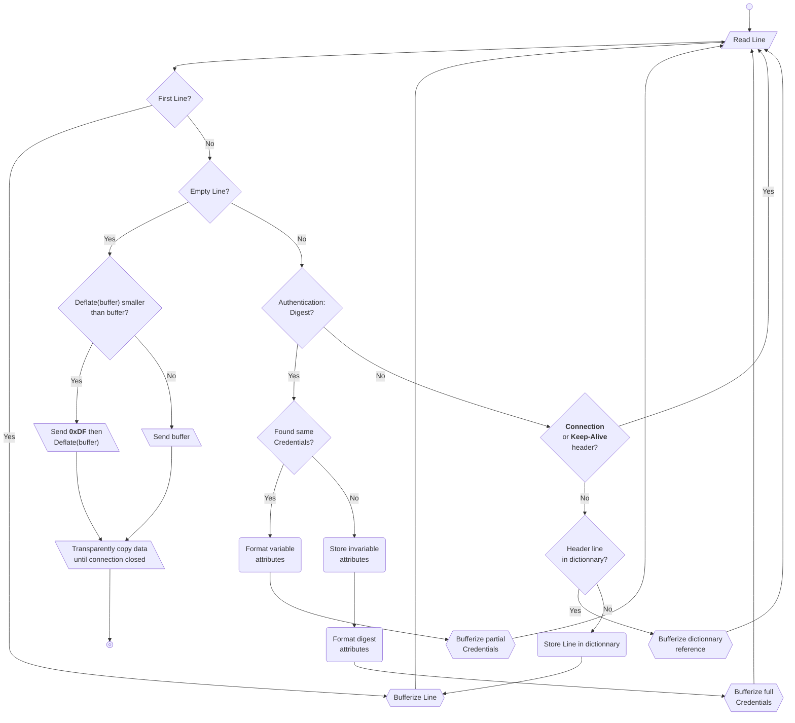

# HTTP Header Compression

This document presents a method which performs Stateful HTTP Header Compression.

This is useful for Layer 7 optimization on a 8-bit safe communication channel, with a bandwidth of 1200bps or below. 

Terrain feedback show 65~85% airtime reduction starting from the second HTTP query, with the same user agent.

To avoid race conditions, one dictionnary *MUST* be used per direction.
Once header transmission has ended, the compression scheme switches to transparent mode.

## Compression algorithm
When the DEFLATE algorithm is used to attempt compressing a payload, it *MUST* be configured in its `Best Compression` setting.

## Decompression
