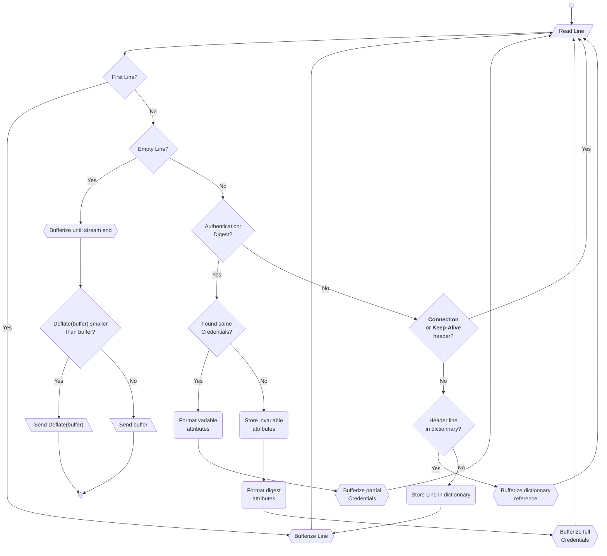

# HTTP Header Compression

This document presents a Stateful HTTP Header Compression method.

This is useful for Layer 7 optimization over a constrained channel.

## Compression algorithm

## Decompression
